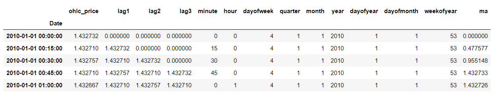

# volatility-regression
EUR / USD regression on ratio and volatility.

Le but de ce notebook est d'effectuer une regression sur la série temporelle du ratio EURUSD et d'extraire la volatilité encombinant les modèles ARIMA et GARCH pour ensuite effectuer une nouvelle regression sur la volatilité.

