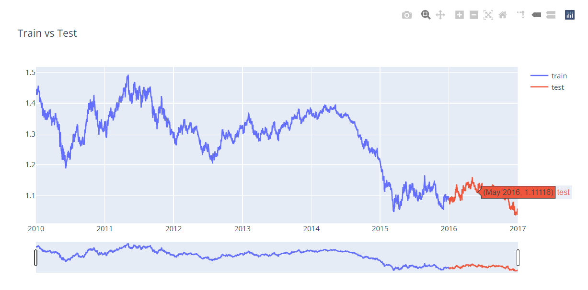
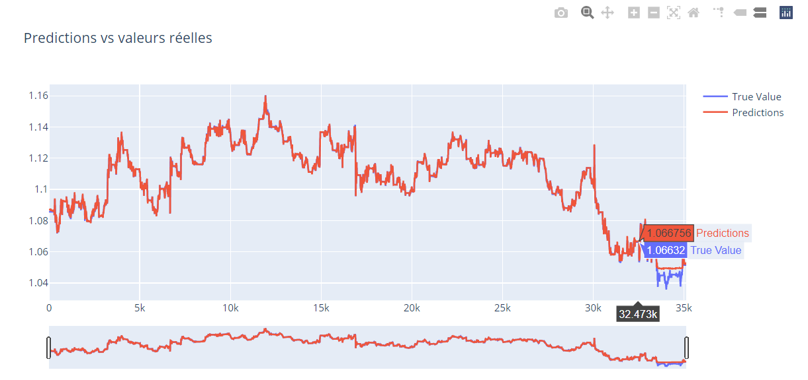
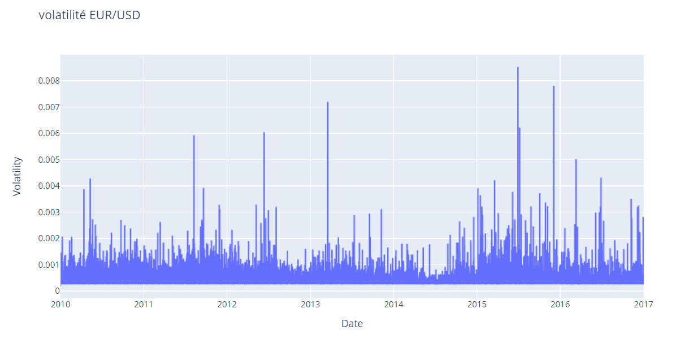
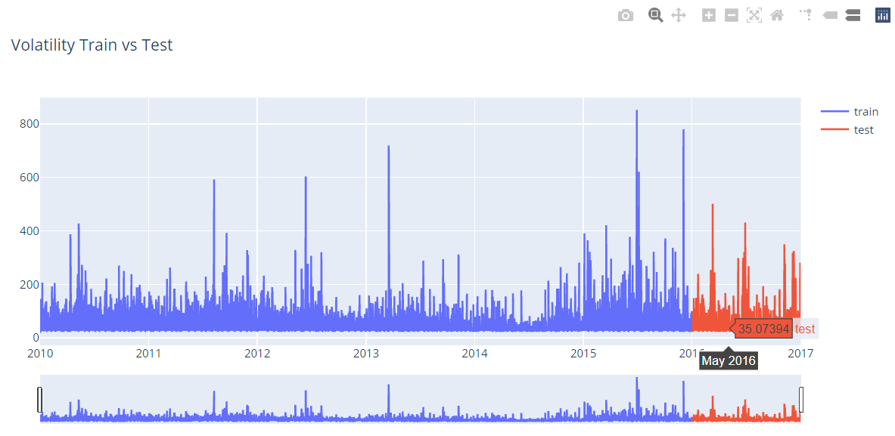
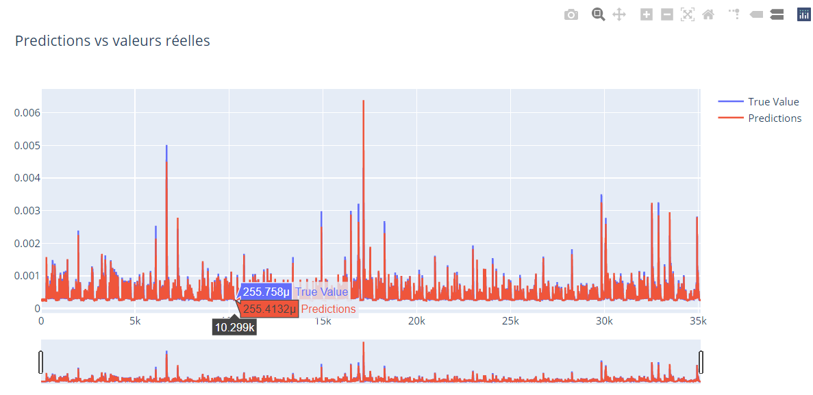

# volatility-regression
EUR / USD regression on ratio and volatility.

Le but de ce notebook est d'effectuer une regression sur la série temporelle du ratio EURUSD et d'extraire la volatilité encombinant les modèles ARIMA et GARCH pour ensuite effectuer une nouvelle regression sur la volatilité.

À l'aide des lag features et des moyennes mobiles, le model XGBoost regressor avec l'optimisation bayésienne des hyperparamètres est capable de faire la prédiction sur le ratio 'ohlc_price'.

Pour extraire la volatilité à partir du prix de l'EUR/USD on applique le modèle GARCH (Generalized Auto Regressive Conditional Heteroskedatic) sur les résidus du modèle ARIMA. Puisque le modèle ARIMA estime la moyenne conditionnelle, le modèle GARCH n'a qu'à estimer la variance conditionnelle présente dans les résidus de l'estimation ARIMA.

N.B. : Les visualisation Plotly nécessitent l'éxecution du notebook en local.

